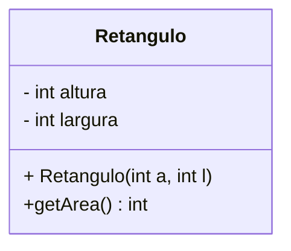
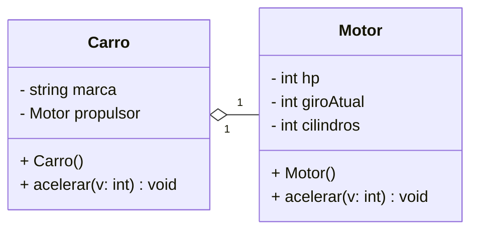

# Diagrama de classes UML

## Primeiro

```mermaid
classDiagram
    
%%    direction LR  - para deixar os diagramas na horzontal
    
    class Retangulo{
        - int altura
        - int largura
        + Retangulo(int a, int l)
        +getArea() int
    }
```

## Segundo

```mermaid
classDiagram
    direction LR
    
    class Carro{
        - string marca
        - Motor propulsor
        + Carro()
        + acelerar(v: int) void
    }
    
    class Motor{
        - int hp
        - int giroAtual
        - int cilindros
        + Motor()
        + acelerar(v: int) void

    }
    
     Carro "1" o-- "1" Motor   

```

