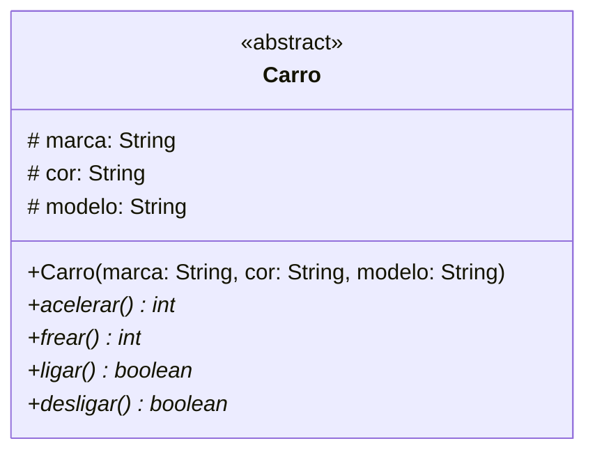

## Jogo de Corrida

```mermaid
classDiagram
    
    class Carro{
        <<abstract>>
        # marca: String
        # cor: String
        # modelo: String
        +Carro(marca: String, cor: String, modelo: String)
        +acelerar() int*
        +frear() int*
        +ligar() boolean*
        +desligar() boolean*
    }


```