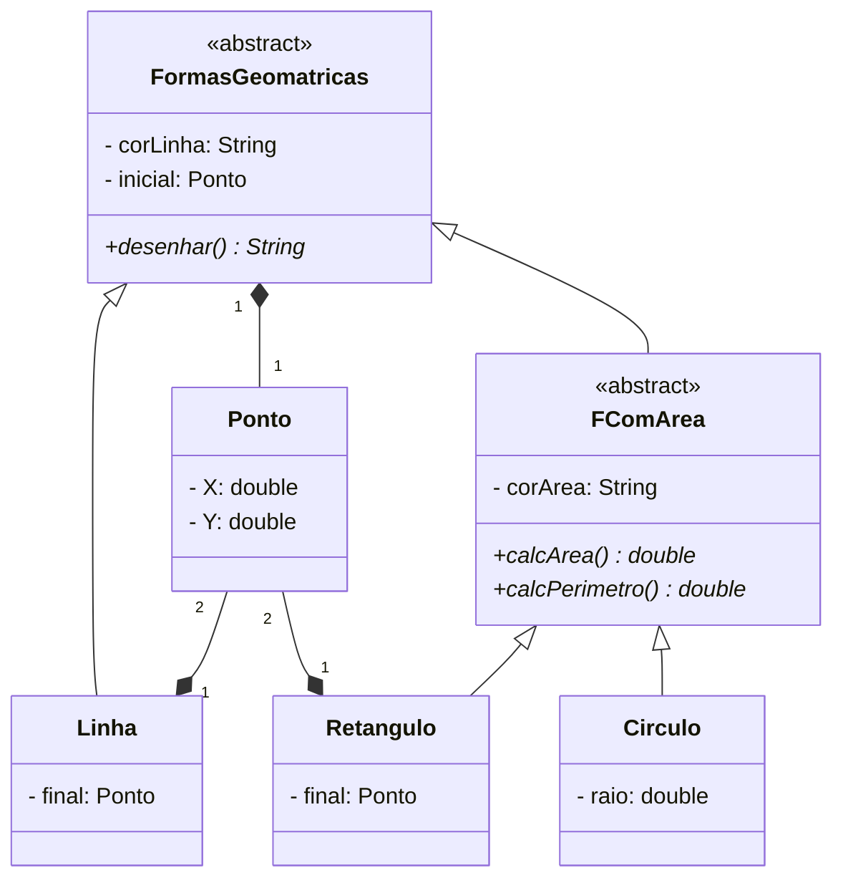

## Desenho Vetorial 2D (GEOMETRIA PLANA)

```mermaid
classDiagram
    
    class FormasGeomatricas{
        <<abstract>>
        - corLinha: String
        - inicial: Ponto
        +desenhar() String*
    }
    
    class Ponto{
        - X: double
        - Y: double
    }
    
    class FComArea{
        <<abstract>>
        - corArea: String
        +calcArea() double*
        +calcPerimetro() double*
    }
    
    class Linha{
        - final: Ponto
    }
    
    class Circulo{
        - raio: double
    }
    
    class Retangulo{
        - final: Ponto
    }
    
    FormasGeomatricas "1" *-- "1" Ponto
    FormasGeomatricas <|-- FComArea
    FormasGeomatricas<|--Linha
    Ponto "2" --* "1" Linha
    Ponto "2" --* "1" Retangulo
    FComArea<|--Circulo
    FComArea<|--Retangulo
    


```