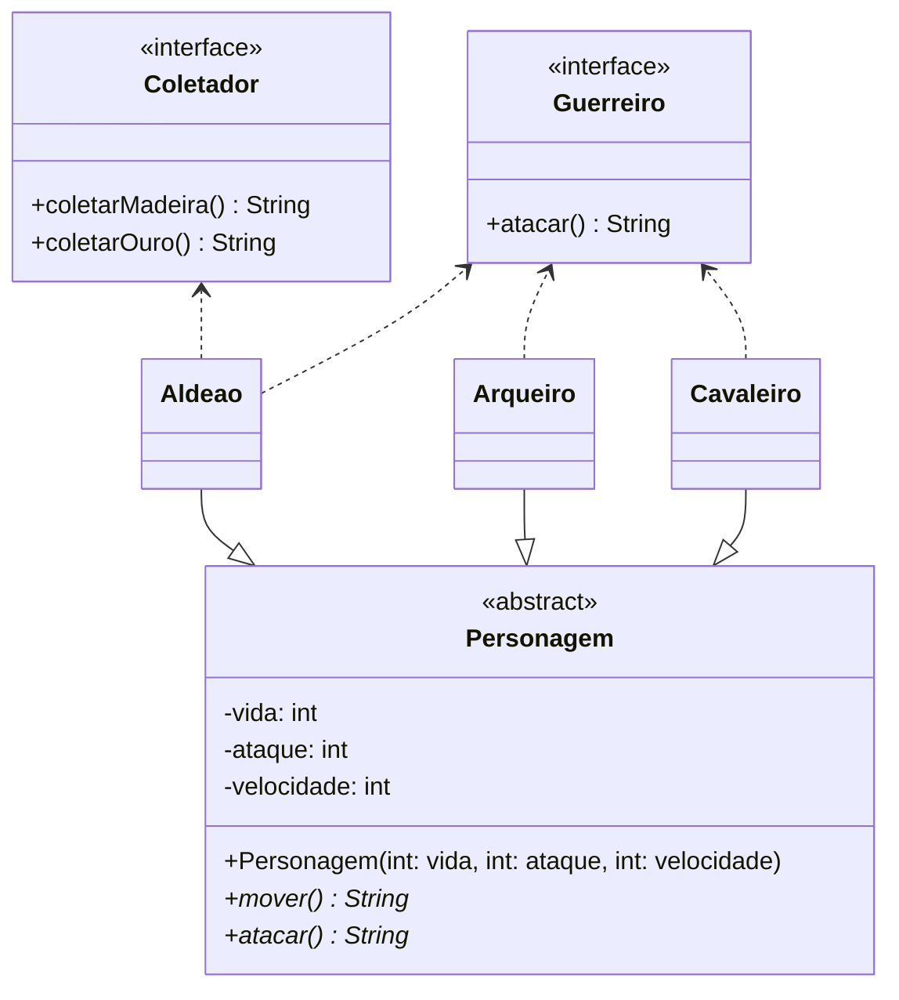

## UML JAVA OF EMPIRES

```mermaid
classDiagram 
    
    direction BT
    
    class Personagem{
        <<abstract>>
        -vida: int
        -ataque: int
        -velocidade: int
        +Personagem(int: vida, int: ataque, int: velocidade )
        +mover() String*
        +atacar() String*
    }
    
    class Coletador{
        <<interface>>
        +coletarMadeira() String
        +coletarOuro() String
    }
    
    class Guerreiro{
        <<interface>>
        +atacar() String
    }
    
    class Aldeao{
    }
    
    class Arqueiro{
    }
    
    class Cavaleiro{
    }
    
    
    Personagem<|--Aldeao
    Personagem<|--Arqueiro
    Personagem<|--Cavaleiro
    Aldeao ..> Coletador
    Aldeao ..> Guerreiro
    Arqueiro ..> Guerreiro
    Cavaleiro ..> Guerreiro
    
    
    
```