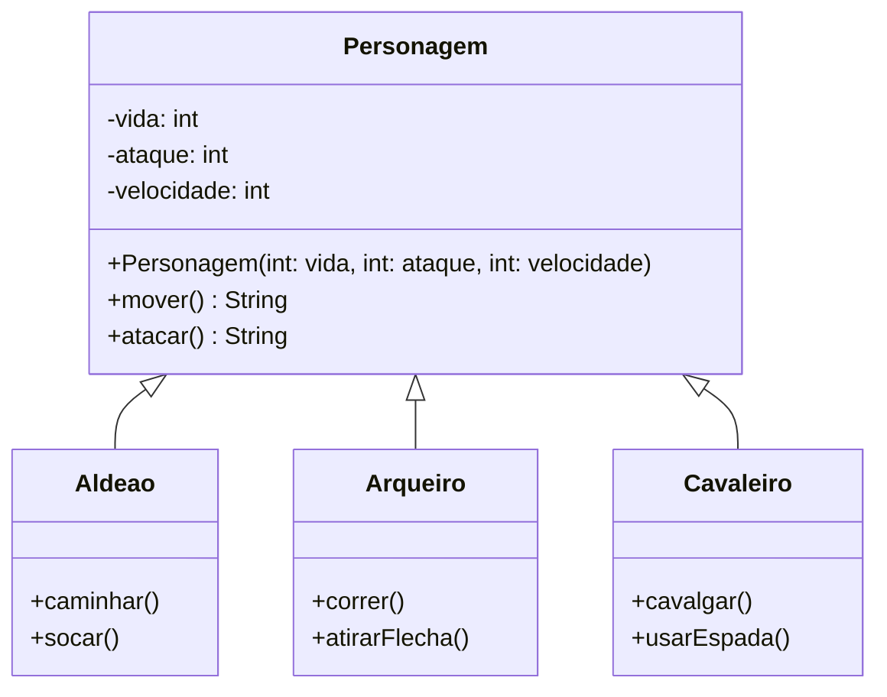

## UML JAVA OF EMPIRES

```mermaid
classDiagram
    
    class Personagem{
        -vida: int
        -ataque: int
        -velocidade: int
        +Personagem(int: vida, int: ataque, int: velocidade )
        +mover() String
        +atacar() String
    }
    
    class Aldeao{
        +caminhar()
        +socar()
    }
    
    class Arqueiro{
        +correr()
        +atirarFlecha()
    }
    
    class Cavaleiro{
        +cavalgar()
        +usarEspada()
    }
    
    Personagem<|--Aldeao
    Personagem<|--Arqueiro
    Personagem<|--Cavaleiro
    
```