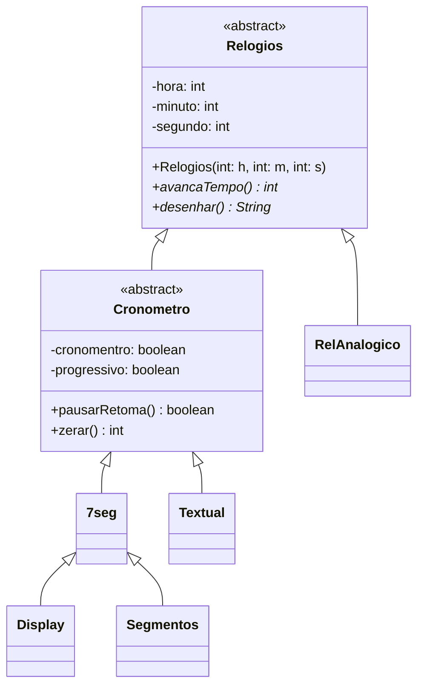

## Relógios

```mermaid
classDiagram
    
    direction TB
    
    class Relogios{
        <<abstract>>
        -hora: int
        -minuto: int
        -segundo: int
        +Relogios(int: h, int: m, int: s)
        +avancaTempo() int*
        +desenhar() String*
        
    }
    
    class 7seg{
       
    }
    
    class Display{
        
    }
    
    class Segmentos{
        
    }
    
    class Textual{
        
    }
    
    class Cronometro{
        <<abstract>>
        -cronomentro: boolean
        -progressivo: boolean
        +pausarRetoma() boolean
        +zerar() int
    }
    
    class RelAnalogico{
        
    }
    
      
    Cronometro <|--7seg
    Cronometro <|--Textual
    Relogios<|--RelAnalogico
    Relogios<|--Cronometro
    7seg<|--Display
    7seg<|--Segmentos
    
    
    
    
```