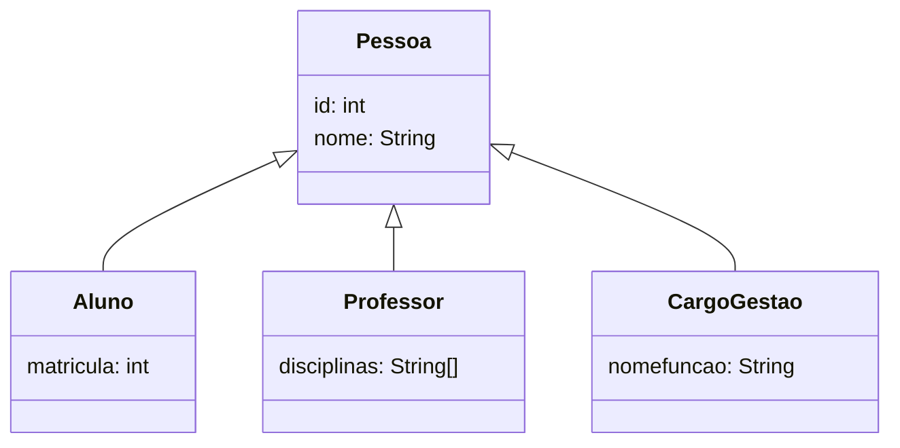
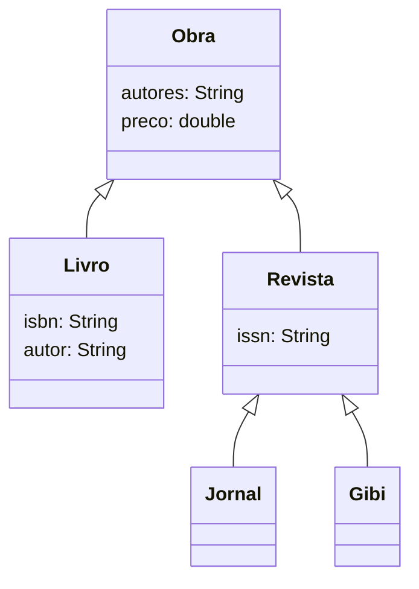
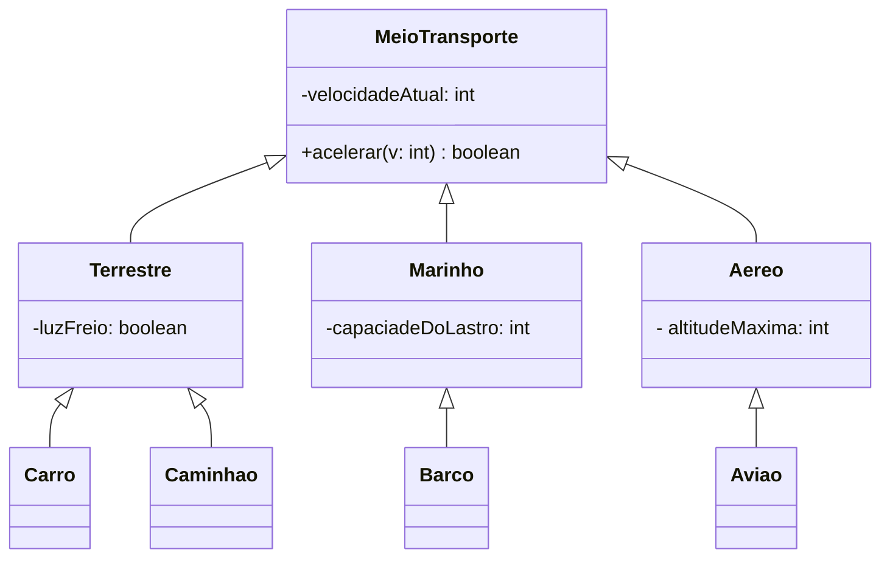
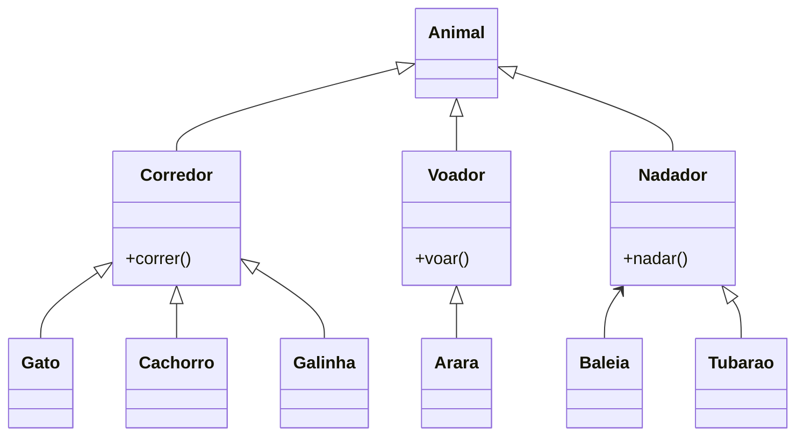

## Exercicio Herança

```mermaid
classDiagram
    
    class Aluno{
        matricula: int
    }
    class Professor{
        disciplinas: String[]
    }
    class CargoGestao{
        nomefuncao: String
    }
    
    class Pessoa{
        id: int
        nome: String
    }
    
    Pessoa<|--Aluno
    Pessoa<|--Professor
    Pessoa<|--CargoGestao
```

```mermaid
classDiagram
    
    class Livro{
        isbn: String
        autor: String
    }
    
    class Revista{
        issn: String
    }
    class Jornal
    class Gibi
    
    class Obra{
        autores: String
        preco: double
    }
    
    Obra <|--Livro
    Obra<|--Revista
    Revista <|-- Jornal
    Revista<|--Gibi
```

```mermaid
classDiagram
    
    class MeioTransporte{
        -velocidadeAtual: int
        +acelerar(v: int) boolean
        
    }
    
    class Terrestre{
        -luzFreio: boolean
    }
    
    class Marinho{
        -capaciadeDoLastro: int
    }
    
    class Aereo{
        - altitudeMaxima: int
    }
    
    class Carro{
        
    }
    
    class Caminhao{
        
    }
    
    class Barco{
        
    }
    
    class Aviao{
        
    }
    
    MeioTransporte<|--Terrestre
    MeioTransporte<|--Marinho
    MeioTransporte<|--Aereo
    Terrestre<|--Carro
    Terrestre<|--Caminhao
    Marinho<|--Barco
    Aereo<|--Aviao

```

```mermaid
classDiagram
    
    class Animal{
        
    }
    
    class Corredor{
        +correr()
        
    }
    
    class Voador{
        +voar()
    }
    
    class Nadador{
        +nadar()
    }
    
    class Gato{
        
    }
    
    class Cachorro{
        
    }
    
    class Arara{
        
    }
    
    class Galinha{
        
    }
    
    class Baleia{
        
    }
    
    class Tubarao{
        
    }
    
    Animal<|--Corredor
    Animal<|--Voador
    Animal<|--Nadador
    Corredor<|--Gato
    Corredor<|--Cachorro
    Nadador<--Baleia
    Voador<|--Arara
    Corredor<|--Galinha
    Nadador<|--Tubarao
    
    
    
```
